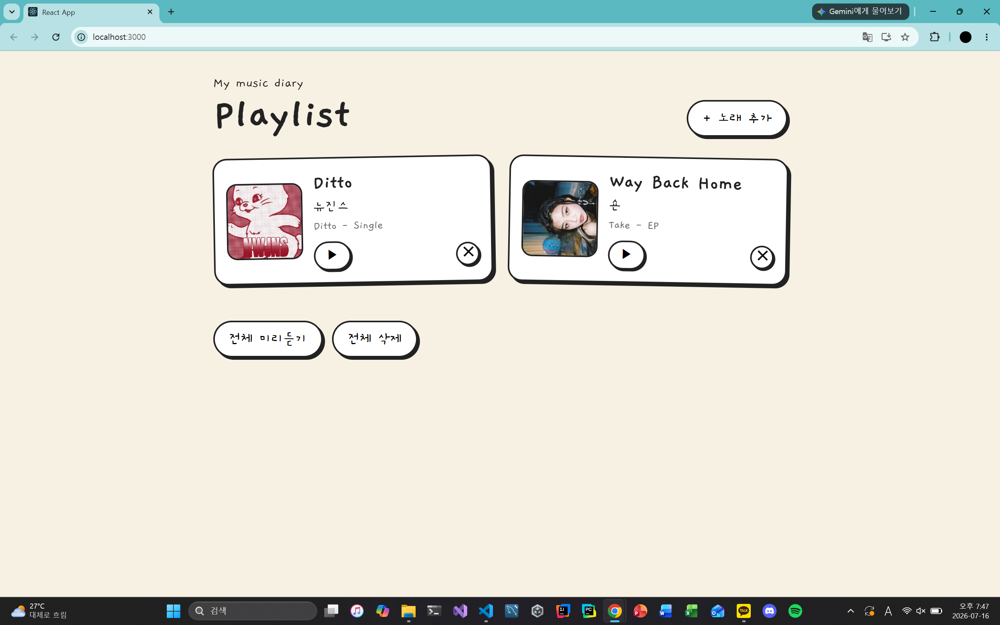
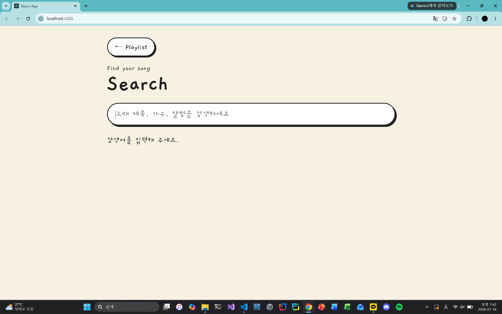
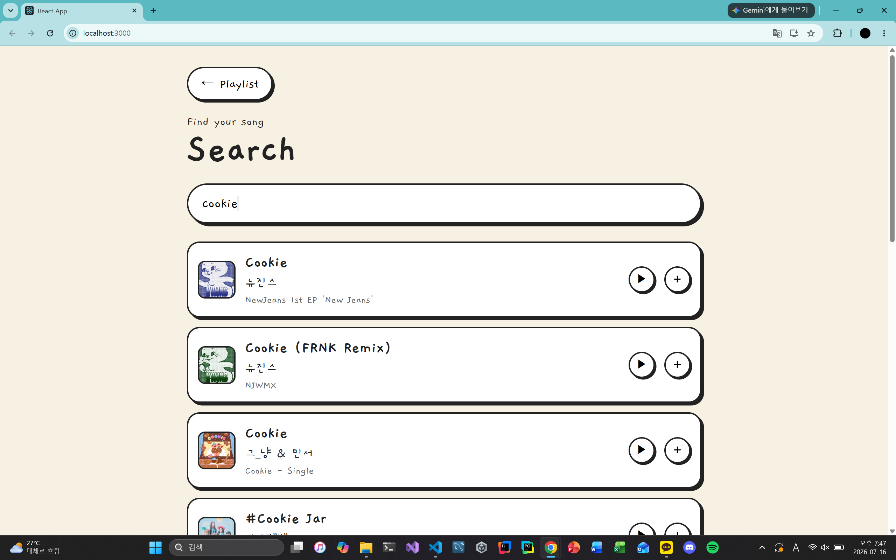
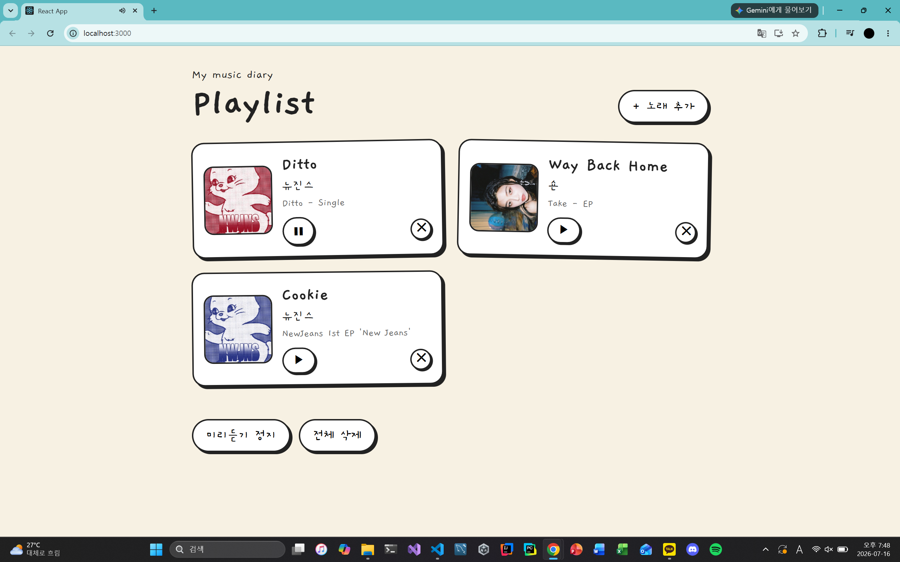

# Playlist Diary

React와 iTunes Search API를 활용하여 구현한 음악 플레이리스트 웹 애플리케이션입니다.

음악 검색, 플레이리스트 생성 및 관리, API에서 제공하는 미리듣기 음원 재생, 순차 재생, LocalStorage를 이용한 플레이리스트 저장 기능을 구현했습니다.

---

## 주요 기능

- 음악 검색
- 플레이리스트 생성 및 관리
- 플레이리스트에 음악 추가 및 삭제
- iTunes Search API에서 제공하는 미리듣기 음원 재생
- 개별 음악 미리듣기
- 플레이리스트에 추가된 미리듣기 음원의 순차 재생
- LocalStorage를 이용한 플레이리스트 저장

---

## 핵심 구현 내용

### 음악 검색

- iTunes Search API를 이용한 음악 검색
- 제목, 가수, 앨범명을 기준으로 검색
- 400ms 입력 대기 후 검색하고, 취소된 이전 요청의 결과는 표시하지 않음
- 검색 중 / 결과 없음 / 요청 실패를 구분하여 표시
- 12초 요청 제한 및 불완전한 검색 항목 검증

### 플레이리스트

- 원하는 음악을 플레이리스트에 추가
- 동일한 음악 중복 추가 방지
- 개별 삭제 및 전체 초기화 기능 구현

### 음악 재생

- iTunes Search API에서 제공하는 미리듣기 음원 재생
- 개별 음악 재생 및 정지
- 플레이리스트에 추가된 음악의 순차 미리듣기 재생
- 새로운 음악 재생 시 기존 재생 음원 정지 처리
- 전체 재생 시 미리듣기 미지원 곡을 건너뛰고 최신 목록을 기준으로 다음 곡 선택
- 재생 실패 시 상태 초기화 및 오류 안내
- 정지 후 다시 재생하면 처음부터 시작 (일시정지·이어듣기 기능 없음)

### 데이터 저장

- LocalStorage를 이용한 플레이리스트 저장
- 새로고침 후에도 플레이리스트 자동 복원
- 저장 데이터 검증, 저장 실패 안내 및 명시적인 초기화
- 다른 탭의 변경 사항 반영 및 저장 전 충돌 감지
- LocalStorage는 원자적 다중 탭 트랜잭션을 지원하지 않으므로 완전히 동시인 쓰기까지 보장하지 않음

---

## 기술 스택

- React
- Vite
- Vitest / React Testing Library
- JavaScript
- CSS
- iTunes Search API
- LocalStorage
- Git / GitHub

---

## 프로젝트 구조

```text
index.html
vite.config.js
src
├─ App.jsx           # 화면 및 사용자 이벤트
├─ usePlayer.js      # 미리듣기 상태와 순차 재생
├─ useSearch.js      # 검색 요청 취소 및 결과 상태
├─ usePlaylist.js    # 저장 및 다른 탭 변경 감지
├─ playlist.js       # 데이터 검증 및 정규화
├─ App.test.jsx      # 회귀 테스트
├─ App.css
├─ index.jsx
└─ index.css
```

---

## 실행 화면

| 플레이리스트 | 음악 검색 |
|--------------|-----------|
|  |  |

| 검색 결과 | 미리듣기 재생 |
|------------|---------------|
|  |  |

---

## 프로젝트에서 배운 점

- 외부 REST API를 활용하여 데이터를 조회하고 화면에 출력하는 방법을 학습했습니다.
- LocalStorage를 이용하여 새로고침 후에도 플레이리스트가 유지되도록 클라이언트 저장소를 활용했습니다.
- React의 상태(State) 관리와 이벤트 처리를 통해 사용자 인터랙션을 구현했습니다.

---

## 향후 개선 사항

- 셔플 재생 기능
- Drag & Drop을 이용한 플레이리스트 순서 변경
- 반응형 UI 개선
- 다크 모드 지원
- 플레이리스트 내보내기 및 불러오기 기능


---

## 실행 방법

- Node.js 22.12 이상(22.x), 24.x 또는 26 이상이 필요합니다. Node.js 24.x를 기준으로 검증했습니다.
- 프로젝트 폴더에서 실행합니다.

```bash
npm ci
npm test
npm run build
npm start
```

- 개발 주소: http://localhost:3000
- 배포 결과: `build/` 폴더
- 배포 결과 확인: `npm run preview` (개발 서버를 종료한 뒤 실행)
- Vite의 루트 `index.html`을 사용합니다. 기존 CRA의 `public/index.html`은 사용하지 않습니다.

---

## 저장 및 외부 API 제한

- 목록은 현재 브라우저의 LocalStorage에 저장되며 서버 계정에 저장되지 않습니다.
- 브라우저 데이터 삭제 시 목록이 사라집니다. 다른 브라우저·기기와 자동 동기화되지 않습니다.
- 주소의 프로토콜·호스트·포트가 다르면 별도 저장소입니다. 기존 목록을 보려면 이전과 동일한 주소로 접속해야 합니다.
- 미리듣기 제공 여부와 길이는 iTunes Search API의 음원에 따릅니다. 전체 음원 스트리밍을 제공하지 않습니다.
- 검색은 한국 스토어 기준 최대 12개 결과를 요청합니다.
- 잘못된 저장 데이터는 자동 덮어쓰기하지 않습니다. 초기화는 사용자 확인 후 수행하며 기존 목록을 삭제합니다.
- 저장 실패 시 해당 추가·삭제 작업을 적용하지 않습니다.

---

## 검증

2026-09-30 수정본 기준:

- Node.js 24 환경에서 회귀 테스트 25개 통과
- 프로덕션 빌드 성공
- `npm audit` 보고 항목 0개 (실행 시점 기준이며 향후 결과는 달라질 수 있음)
- 삭제한 곡 건너뛰기, 미지원 곡 처리, 음원 오류·늦은 응답, 검색 경합·시간 초과, 저장 오류·다중 탭 변경 등을 모의 환경에서 검증
- 실제 iTunes 음원 재생 및 브라우저별·모바일 화면의 수동 검증 결과는 아직 기록하지 않음
